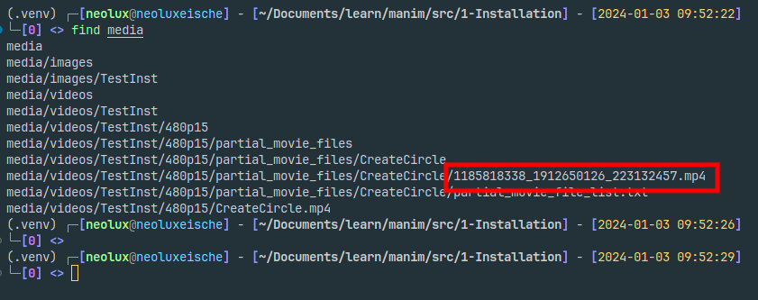
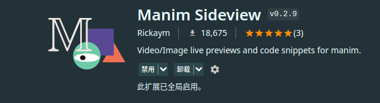
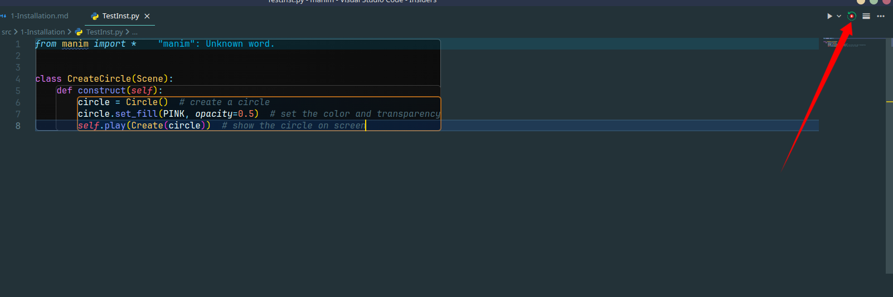
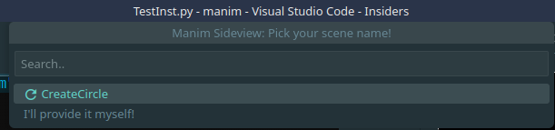
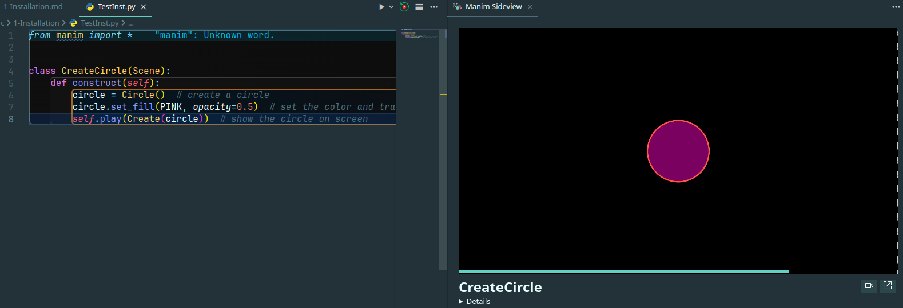

# 安装 Manim

## 创建 Python 环境

```bash
# 使用 venv 在 .venv 文件夹下创建虚拟环境
python3 -m venv .venv

source .venv/bin/activate # 激活虚拟环境
```

## 安装 manim 包

```bash
pip3 install manim
```

## 测试环境

### 直接测试

```bash
# 编辑源文件
nvim test.py
```

输入 Python 代码

```Python
from manim import *


class CreateCircle(Scene):
    def construct(self):
        circle = Circle()  # create a circle
        circle.set_fill(PINK, opacity=0.5)  # set the color and transparency
        self.play(Create(circle))  # show the circle on screen
```

运行测试

```bash
manim -pql test.py CreateCircle
```

完成后会自动打开视频。视频存储在源码同级目录下的 `media` 文件夹中



### 配置 VSCode

使用 VSCode, 安装插件 Manim Sideview, 可以实现在 VSCode 中自动处理代码和侧边预览



同样的，写好代码，在 VSCode 中配置好虚拟环境。

打开源代码文件，右上角出现插件图标



点击后选择写好的类，即可自动编译视频并侧边预览。





代码更改时，插件会自动编译。


