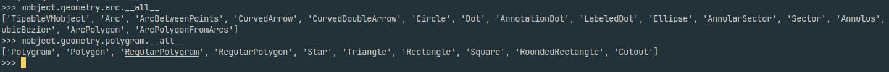

# Manim 基本使用

## 场景(Scene)

首先导入 manim 包

```python3
from manim import *
```

manim 中有 Scene(场景)类，所有的动画图像都是它的子类

在自定义的类中，需要写一个固定的 `construct()` 方法，用来添加元素，编辑动画效果等操作

创建一个场景的子类，并写出 `construct()` 方法

```python3
class CreateCircle(Scene):
    def construct(self):
        ...
```

## 图形

manim > mobject > geometry 下可以找到所有的形状

geometry 下有 arc(弧线), line(线), polygram(多边形) 等

查看各个类的 `__all__` 可以看到所有的元素



创建图形只需要在 `construct()` 方法中创建该图形的类的对象

```python3
c = Circle()

